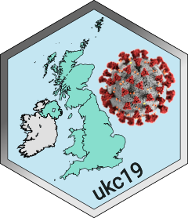

# ukc19 <a href="https://ai4ci.github.io/ukc19/"></a>

<!-- badges: start -->
[](https://github.com/ai4ci/ukc19/actions/workflows/R-CMD-check.yaml)
[](https://ai4ci.r-universe.dev/ukc19)
[](https://gtr.ukri.org/projects?ref=EP%2FY028392%2F1)
[](https://doi.org/10.5281/zenodo.17733500)
<!-- badges: end -->

A selection of aggregated COVID-19 data from the UK, in an easy to use form
for teaching and demonstration purposes. 

This data is sourced from publicly available data sets from various UK government
websites where different aspects of the UK COVID-19 response published data, and from
publicly available data from key studies. It is by no means comprehensive but aims to
capture some of the main data in a single place so that it is preserved.

At present the data is mostly focused on England.

## Installation

You can install the released version of `ukc19` from
[CRAN](https://CRAN.R-project.org) with:

``` r
install.packages("ukc19")
```

Interim releases of `ukc19` are hosted on the 
[AI4CI r-universe](https://ai4ci.r-universe.dev/). Installation from there is as
follows:

``` r
options(repos = c(
  "ai4ci" = 'https://ai4ci.r-universe.dev/',
  CRAN = 'https://cloud.r-project.org'))

# Download and install ukc19 in R
install.packages("ukc19")
```

You can install the development version of `ukc19` from
[GitHub](https://github.com/ai4ci/ukc19) with:

``` r
# install.packages("devtools")
devtools::install_github("ai4ci/ukc19")
```

## Funding

The authors gratefully acknowledge the support of the UK Research and Innovation
AI programme of the Engineering and Physical Sciences Research Council 
[EPSRC grant EP/Y028392/1](https://gtr.ukri.org/projects?ref=EP%2FY028392%2F1).
